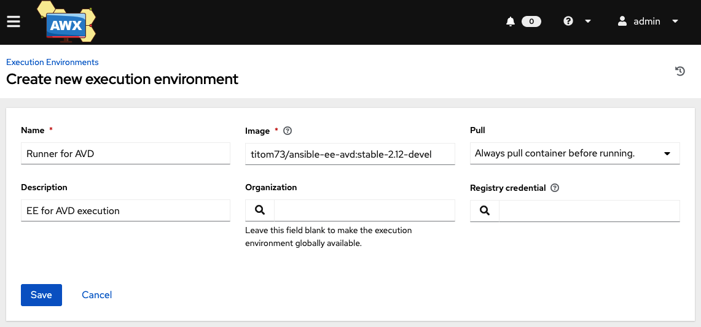
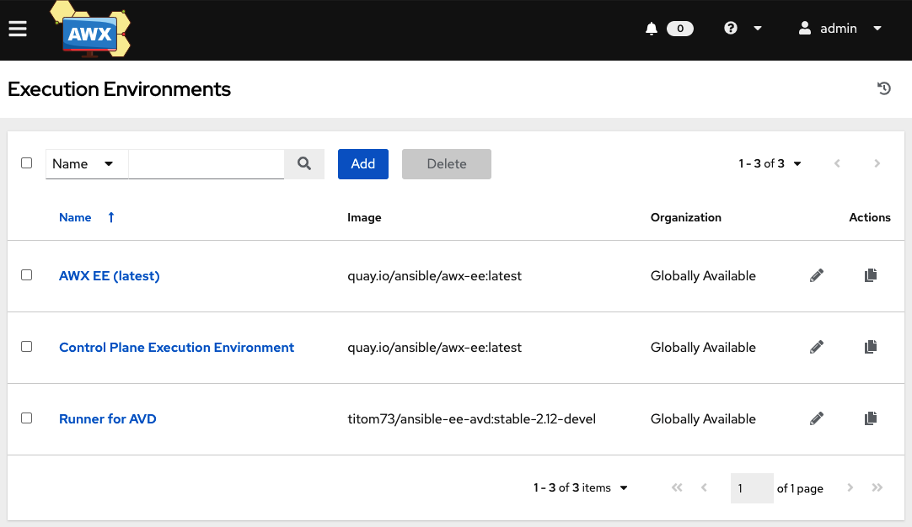
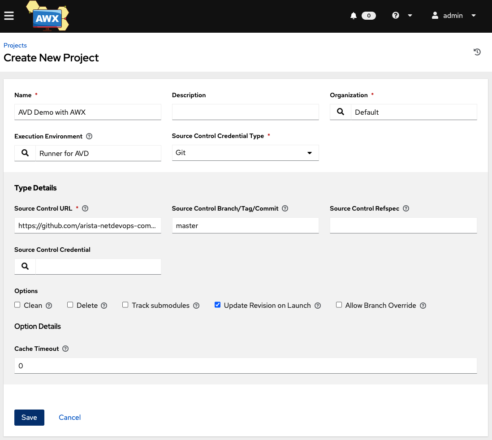
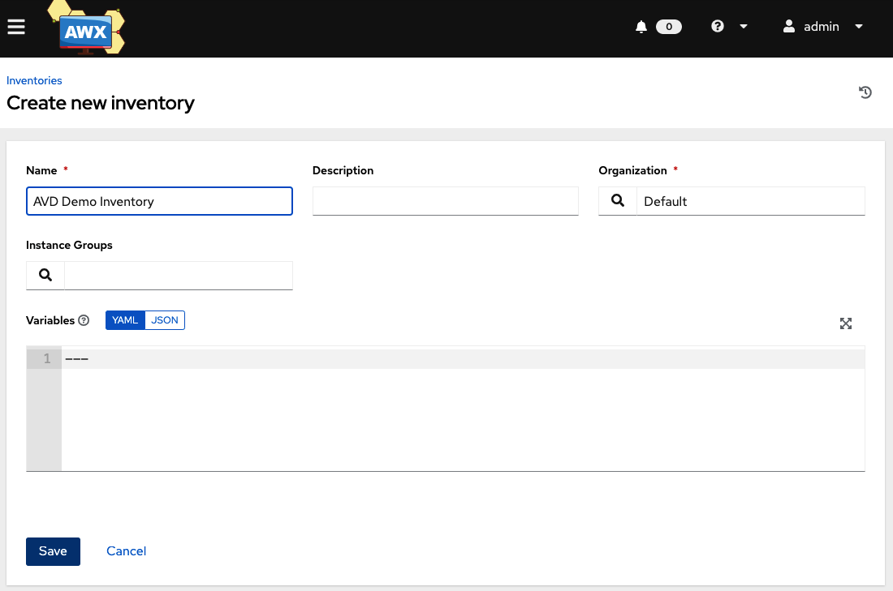
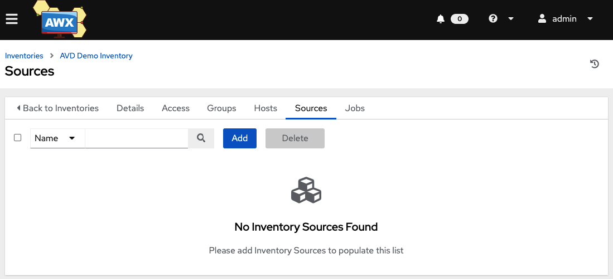
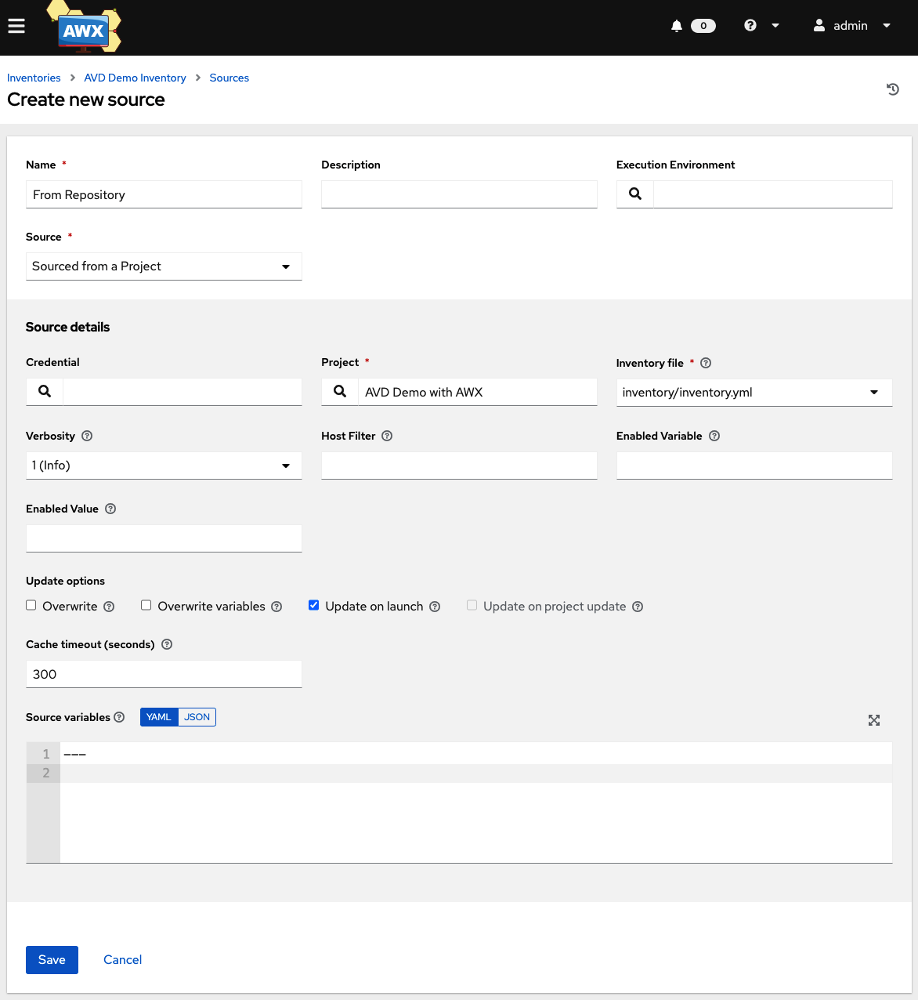
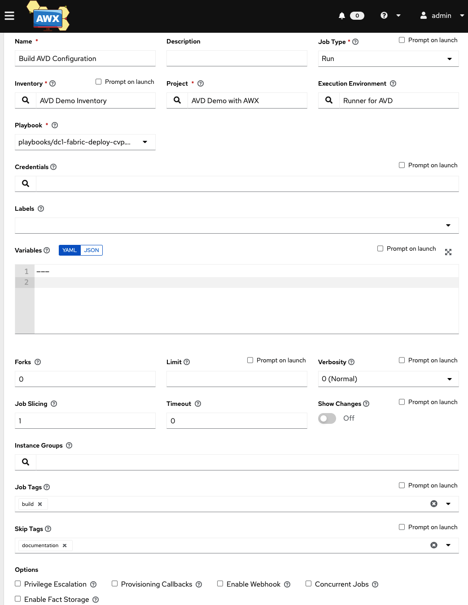

  
# AVD & CVP Playbooks integration in AWX/Tower

- [AVD & CVP Playbooks integration in AWX/Tower](#avd--cvp-playbooks-integration-in-awxtower)
  - [About](#about)
    - [Disclaimer](#disclaimer)
    - [Before starting](#before-starting)
  - [Requirements](#requirements)
  - [AWX Installation](#awx-installation)
    - [Deploy AWX Operator](#deploy-awx-operator)
    - [Deploy an AWX instance](#deploy-an-awx-instance)
      - [AWX manifest](#awx-manifest)
      - [AWX deployment](#awx-deployment)
      - [Get access information](#get-access-information)
  - [Configure AWX](#configure-awx)
    - [Create Ansible Execution Environment](#create-ansible-execution-environment)
    - [Install Ansible Execution Environment](#install-ansible-execution-environment)
    - [Configure a Project](#configure-a-project)
    - [Create inventory](#create-inventory)
    - [Create Template (aka Playbook)](#create-template-aka-playbook)
  - [What's next ?](#whats-next-)
  - [Resources](#resources)
  - [License](#license)

## About

This example shows how to deploy basic __EVPN/VXLAN Fabric__ based on __[Arista Validated Design roles](https://github.com/aristanetworks/ansible-avd)__ using Ansible Tower/AWX. This repository will be used as project on AWX and we will describe how to configure Tower for the following topics:

- Create a project
- Create inventory
- Install collections
- Install python requirements

### Disclaimer

This guide is based on our field experience and it is not considered as an official AWX/Tower design guide.

### Before starting

If you want to see how to build your inventory and all related variables, it is recommended to read following documentation:

- [How to start](https://www.avd.sh/docs/how-to/first-project/)
- [L3LS EVPN Abstraction role](https://www.avd.sh/roles/eos_l3ls_evpn/)

This guide describe how to install and configure AWX to run Arista AVD ansible collection using official approach as per [AWX repository](https://github.com/ansible/awx/blob/devel/INSTALL.md#the-awx-operator) and requires to have a Kubernetes cluster available to install awx operator.

## Requirements

To play with this repsoitory, you need:

- A kubernetes cluster set up and ready to use. [AWX Operator repository](https://github.com/ansible/awx-operator) uses [minikube](https://minikube.sigs.k8s.io/docs/), but any flavor can be used.
- A docker engine or podman to build Ansible Execution Engine.

## AWX Installation

### Deploy AWX Operator

If you do not have installed AWX operator yet, you can install it with the following commands:

```bash
# Clone repository
$ git clone https://github.com/ansible/awx-operator.git

# Create namespace in kubernetes
$ kubectl create namespace awx-avd-demo
namespace/awx-avd-demo created

kubectl config set-context --current --namespace=awx-avd-demo
Context "minikube" modified

# Deploy operator
$ cd awx-operator
$ export NAMESPACE=awx-avd-demo
$ make deploy
```

Full step by step is available on [AWX Operator repository](https://github.com/ansible/awx-operator)

### Deploy an AWX instance

All the following steps will be executed in this repository as it provides both ansible content and AWX deployment manifest

#### AWX manifest

```yaml
# manifests/awx-instance.yml
---
apiVersion: awx.ansible.com/v1beta1
kind: AWX
metadata:
  name: awx-for-avd-demo
spec:
  service_type: nodeport
```

#### AWX deployment

To deploy AWX, just run the following command:

```bash
# Check operator is active
$ kubectl get pods
NAME                                               READY   STATUS    RESTARTS   AGE
awx-operator-controller-manager-6d959bd7dd-nwjz8   2/2     Running   0          6m54s

# Deploy AWX
$ kubectl apply -f manifests/awx-instance.yml

# Monitor deployment (it can take time to appear)
$ kubectl get pods -l "app.kubernetes.io/managed-by=awx-operator"
NAME                        READY   STATUS    RESTARTS   AGE
awx-demo-postgres-0         1/1     Running   0          24s
awx-demo-6f58cd7b8d-6dpwr   4/4     Running   0          6s
```

Once container are UP and running, you should monitor logs to check provisioning completion:

```bash
$ kubectl logs -f deployments/awx-operator-controller-manager -c awx-manager
...
PLAY RECAP *********************************************************************
localhost                  : ok=62   changed=0    unreachable=0    failed=0    skipped=45   rescued=0    ignored=0
```

#### Get access information

AWX instance is available via a node port. So you can use following command:

```bash
# For minikube
minikube service awx-demo-service --url -n $NAMESPACE

# For other flavors
$ kubectl get services
NAME                                              TYPE        CLUSTER-IP      EXTERNAL-IP   PORT(S)        AGE
awx-operator-controller-manager-metrics-service   ClusterIP   10.152.183.37   <none>        8443/TCP       14m
awx-demo-postgres                                 ClusterIP   None            <none>        5432/TCP       6m35s
awx-demo-service                                  NodePort    10.152.183.71   <none>        80:31025/TCP   6m19s
```

> In this example, instance is listening on port `31025`

AWX Credentials are `admin` and password generated by Kubernetes

```bash
kubectl get secret awx-demo-admin-password -o jsonpath="{.data.password}" | base64 --decode
O2WBkBTW7CKWUZLqm263PklCL5m7K0GU
```

## Configure AWX

### Create Ansible Execution Environment

Ansible has recently introduced [Execution Environment](https://docs.ansible.com/automation-controller/latest/html/userguide/execution_environments.html) which is basically a container to execute your playbooks. The main interest is you don't have to build a virtual environment in AWX.

To build such container, you need docker or podman as well as [`ansible-builder`](https://www.ansible.com/blog/introduction-to-ansible-builder).

```bash
$ pip install ansible-builder
```

And then you have to define your builder file:

```yaml
---
version: 1

build_arg_defaults:
  EE_BASE_IMAGE: 'quay.io/ansible/ansible-runner:stable-2.12-devel'

dependencies:
  galaxy: requirements.yml
  python: requirements.txt

additional_build_steps:
  prepend: |
    RUN pip install --upgrade pip setuptools
    RUN yum install -y \
        make \
        wget \
        curl \
        less \
        git \
        zsh \
        vim \
        sshpass
```

> Note that collection definition is part of [requirements.yml](./requirements.yml). So a new image should be build each time you want to upgrade to a new avd or cvp collection.

To build image, nothing complex:

```bash
$ ansible-builder -f exeution-environment.yml -t <your-docker-image:tag>
```

Ansible version for runner can be found in [ansible-runner registry](quay.io/ansible/ansible-runner)

Also upload image to a registry.

```bash
$ docker push <your-docker-image:tag>
```

### Install Ansible Execution Environment

After your image has been uploaded on a public or private registry, you can define this Execution Environment in AWX (__Administration__ / __Execution Environments__)



> If your image is on a private registry, you have to create credentials for your registry



### Configure a Project

Now we will use this repository as source for both playbooks and inventory. Go to __Resources__ / __Projects__ and select __Add__

This project will be used for 2 things:

- Get our inventory and all attached variables.
- Get our playbooks to run in AWX.

Configure project with:

- SCM Type: Git
- SCM Branch: master
- Ansible Environment: /your/path/to/venv
- SCM URL: <https://github.com/arista-netdevops-community/avd-with-ansible-tower-awx.git>



Don't forget the following elements:

- Set correct Execution Environment from the list.
- Select correct branch
- Configure optional credentials if required

### Create inventory

We can now create inventory in AWX in __Resources__ / __Inventories__ and select __Add Inventory__



Click Save and and then on __Sources__



And then, complete information:



### Create Template (aka Playbook)

Template is in charge of the glue between inventory, execution environment and playbook to run.

Go to __Resources__ / __Templates__ and select __Add Job Template__



In this section, feel free to use your tags based on your need. Here playbook will execute only build and not deploy and will skip documentation.

## What's next ?

Now everything is set and you should be able to run your playbook or build your own workflow !


## Resources

- Ansible [Arista Validated Design](https://github.com/aristanetworks/ansible-avd) repository.
- Ansible [Arista CloudVision Collection](https://github.com/aristanetworks/ansible-cvp) repository.
- [AWX Operator repository](https://github.com/ansible/awx-operator)
- [Minikube](https://minikube.sigs.k8s.io/docs/)
- [Ansible builder](https://www.ansible.com/blog/introduction-to-ansible-builder)

## License

Project is published under [Apache License](LICENSE).
